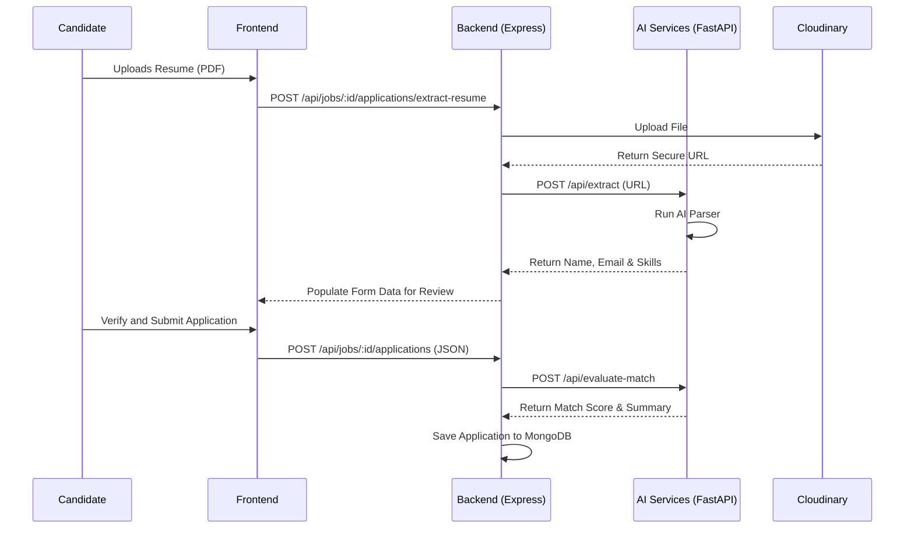
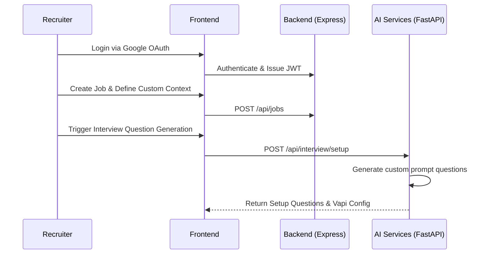

# HireIQ

An advanced, AI-powered recruitment and voice-interview platform designed to streamline the candidate screening process. HireIQ automatically parses resumes, evaluates candidates against job requirements, manages recruiter workflows, and hosts conversational voice interviews using AI agents.

---

## 🚀 Key Features

*   **AI Resume Parsing:** Instant extraction of candidate names, emails, and skills from uploaded PDF resumes.
*   **Intelligent Match Evaluation:** Automated assessment scoring how well a candidate's profile matches specific Job Descriptions (JDs).
*   **Conversational AI Voice Interviews:** Seamless integration with Vapi.ai for real-time, interactive phone/voice screening.
*   **Robust Recruiter Dashboard:** Complete job management (CRUD), candidate application tracking, and detailed analytical reports (visualized via Chart.js).
*   **Security & Auth:** Secure recruiter onboarding via Google OAuth and JWT-based session management.
*   **Scalable Architecture:** Microservices split into Express (business logic) and FastAPI (AI processing) backends.

---

## 🛠️ Tech Stack

### 🎨 Frontend Stack
| Technology | Description |
| :--- | :--- |
| **React 19** | Core UI library built with TypeScript and Vite |
| **Tailwind CSS v4** | Utility-first CSS framework for modern, responsive designs |
| **Lucide React** | Scalable vector icon pack |
| **Chart.js & React Chartjs 2** | Rich interactive graphs on the recruiter dashboard |
| **React Router Dom v7** | Client-side application routing |
| **@vapi-ai/web SDK** | Live websocket-based voice agent streaming |

### ⚙️ Backend Stack
| Technology | Description |
| :--- | :--- |
| **Node.js & Express** | TypeScript REST API framework for business logic |
| **MongoDB & Mongoose** | Primary database and schema validation |
| **Redis** | In-memory cache for speed and rate limiting |
| **Google OAuth** | Secure authentication via Arctic & Google Auth SDK |
| **Cloudinary** | Media/document storage for candidate resumes |
| **Brevo & Resend** | Email engines for automation & recruiter updates |

### 🤖 AI Services Stack
| Technology | Description |
| :--- | :--- |
| **FastAPI & Uvicorn** | Asynchronous Python framework for high-throughput AI API services |
| **Beanie ODM** | Asynchronous MongoDB Object-Document Mapper for Python |
| **Custom LLM Integrations** | Engines for resume parsing, JD matching, and interview setup |

---

## 📁 Repository Structure

### 🟢 Backend Service (`backend/`)
```text
backend/
├── src/
│   ├── config/       # Database & service integration configurations
│   ├── controllers/  # Route handler controllers containing business logic
│   ├── middlewares/  # Authentication & validation filters
│   ├── models/       # MongoDB Mongoose schema models
│   ├── routes/       # Express route mapping declarations
│   ├── templates/    # HTML email layouts (Brevo/Resend)
│   └── server.ts     # Express server starter
├── package.json      # Node.js configurations & script dependencies
└── tsconfig.json     # Backend TypeScript configuration
```

### 🔵 Frontend Application (`frontend/`)
```text
frontend/
├── public/           # Static asset assets
├── src/
│   ├── components/   # Shared reusable UI elements
│   ├── pages/        # Main dashboard and recruiter/candidate views
│   ├── index.css     # Global stylesheets (Tailwind v4)
│   └── main.tsx      # React DOM bootstrap entry
├── package.json      # Frontend client dependencies
├── vite.config.ts    # Vite bundler configurations
└── tsconfig.json     # Frontend TypeScript setup
```

### 🐍 AI Services (`ai-services/`)
```text
ai-services/
├── app/
│   ├── config/       # MongoDB configurations
│   ├── models/       # Beanie ODM schema models
│   ├── routers/      # FastAPI endpoint routers (parsing, interviews)
│   ├── services/     # Heavy lifting AI evaluation & parsing scripts
│   ├── utils/        # Auth middleware & decorators
│   ├── main.py       # FastAPI server starter
│   └── text_llm.py   # LLM execution layers
└── requirements.txt  # Python pip dependencies list
```

---

## 🔄 System Architecture & Flows

### 1. Resume Extraction & Application Flow


### 2. Recruiter Operations Flow


---

## ⚙️ Setup & Installation

### Environment Variables

Before running the application, you must create `.env` files in each service directory. Below are the required configurations:

#### 🟢 Backend Configuration (`backend/.env`)
| Variable | Description |
| :--- | :--- |
| `PORT` | Port number for the backend server (default: `5000`) |
| `MONGODB_URI` | MongoDB database connection string |
| `GOOGLE_CLIENT_ID` | Google Client ID for OAuth authentication |
| `GOOGLE_CLIENT_SECRET` | Google Client Secret for OAuth authentication |
| `REDIRECT_URI` | Redirection URL after Google Sign-In (typically `http://localhost:5173/auth/google`) |
| `JWT_ACCESS_SECRET` | Secret key used to sign and verify access JWTs |
| `JWT_REFRESH_SECRET` | Secret key used to sign and verify refresh JWTs |
| `RESEND_API_KEY` | API key for email delivery via Resend |
| `CLOUD_NAME` | Cloudinary cloud account name for file storage |
| `API_KEY` | Cloudinary API Key |
| `API_SECRET` | Cloudinary API Secret |
| `baseURL` | OpenRouter base URL for LLM queries |
| `apiKey` | OpenRouter API Key |
| `PYTHON_SERVICE_URL` | Base endpoint URL for the FastAPI AI server (`http://localhost:7000/api`) |
| `FRONTEND_URL` | Base URL of the client React application (`http://localhost:5173`) |
| `REDIS_URL` | Connection URL for Redis cache |
| `BREVO_API_KEY` | API key for Brevo transactional email sender |

#### 🔵 Frontend Configuration (`frontend/.env`)
| Variable | Description |
| :--- | :--- |
| `VITE_API_BASE_URL` | Base URL of the backend API (`http://localhost:5000/api`) |
| `VITE_AI_API_BASE_URL` | Root URL of the FastAPI server (`http://localhost:7000`) |
| `VITE_GOOGLE_CLIENT_ID` | Client ID for Google login authentication |
| `VITE_GOOGLE_AUTH_REDIRECT_URL` | OAuth redirect URI callback link |
| `VITE_VAPI_PUBLIC_KEY` | Public key credential for Vapi.ai SDK voice interfaces |

#### 🐍 AI Services Configuration (`ai-services/.env`)
| Variable | Description |
| :--- | :--- |
| `PORT` | Server port for the FastAPI server (default: `7000`) |
| `MONGODB_URI` | MongoDB connection string |
| `OPEN_ROUTER_API_KEY` | API key for OpenRouter LLM queries |
| `OPEN_ROUTER_BASE_URL` | Base URL endpoint for OpenRouter LLMs |
| `JWT_ACCESS_SECRET` | Secret key used to verify incoming recruiter session JWTs |


### 1. Run the Backend Server
```bash
cd backend
npm install
npm run dev
```

### 2. Run the Frontend App
```bash
cd frontend
npm install
npm run dev
```

### 3. Run the AI Services
1. Create a Python virtual environment:
   ```bash
   cd ai-services
   python -m venv venv
   source venv/Scripts/activate  # On Windows: venv\Scripts\activate
   ```
2. Install dependencies:
   ```bash
   pip install -r requirements.txt
   ```
3. Run the FastAPI application:
   ```bash
   cd app
   python main.py
   ```

---

## 📝 API Endpoints

### 🟢 Core Express Server (`/api`)

#### 1. Recruiter Authentication
| Method | Endpoint | Auth Required | Description |
| :--- | :--- | :--- | :--- |
| `POST` | `/api/auth/login` | No | Log in recruiter using email and password |
| `GET` | `/api/auth/google` | No | Initiate Google OAuth2 login flow |
| `GET` | `/api/auth/me` | Yes | Get currently logged-in recruiter profile |
| `POST` | `/api/auth/logout` | Yes | Clear recruiter session and cookies |

#### 2. Job & Candidate Management (Recruiter)
| Method | Endpoint | Auth Required | Description |
| :--- | :--- | :--- | :--- |
| `GET` | `/api/jobs` | Yes | Retrieve recruiter-created jobs (paginated) |
| `POST` | `/api/jobs` | Yes | Publish a new job posting |
| `PUT` | `/api/jobs/:id` | Yes | Edit an existing job posting |
| `DELETE` | `/api/jobs/:id` | Yes | Delete a job posting |
| `GET` | `/api/applications/candidates` | Yes | View candidates across all job applications |

#### 3. Candidate Application Flow (Public)
| Method | Endpoint | Auth Required | Description |
| :--- | :--- | :--- | :--- |
| `GET` | `/api/jobs/:id` | No | Get public details of a job posting |
| `POST` | `/api/jobs/:id/applications/extract-resume` | No | Upload resume PDF to Cloudinary & trigger AI parsing |
| `POST` | `/api/jobs/:id/applications` | No | Submit final application data and run match evaluation |

---

### 🐍 AI Services Server (`/api`)

| Method | Endpoint | Auth Required | Description |
| :--- | :--- | :--- | :--- |
| `POST` | `/api/extract` | No | Core PDF parser: extracts name, email, and skills |
| `POST` | `/api/evaluate-match` | No | Compares candidate profile against job description text |
| `POST` | `/api/generate-job` | No | LLM utility to generate job details given a title prompt |
| `POST` | `/api/interview/setup` | Yes | Generates customizable voice interview questions |
| `POST` | `/api/interview/save` | Yes | Save interview configuration to the database |

For more setup instructions and parameters, see the comprehensive [docs/endpoint.md](file:///d:/HireIQ/docs/endpoint.md).
---

## 🧠 Challenges & Learnings

### Challenges
1. **Real-time Voice Latency (Vapi.ai Integration):** Managing full-duplex audio websocket connections with minimal latency so that candidate conversations with the AI recruiter feel natural and real-time.
2. **Accurate PDF Parsing & Schema Alignment:** Extracting data consistently from a variety of poorly structured or heavily styled candidate resumes. Standardizing this via prompt validation patterns.
3. **Cross-Service Authentication & Sync:** Synchronizing JWT sessions and Mongoose (Node.js) schema connections with Beanie ODM (Python FastAPI) to ensure unified database records.

### Learnings
1. **Advanced Prompt Engineering:** Learned how structured system prompts can guarantee JSON outputs from LLMs for resume evaluations and autocompletions.
2. **Asynchronous Architecture:** Gained deep experience in organizing async tasks between an Express core router, FastAPI assistants, and Redis caching.
3. **Voice SDK Implementation:** Mastered conversational state flow configuration using webhooks and frontend voice client connections.

---

## 👥 Author

*   **Santu** - MCA Student, Presidency College, Bengaluru
    *   📧 [santu700141@gmail.com](mailto:santu700141@gmail.com)
    *   🔗 [LinkedIn](https://www.linkedin.com/in/santu-pramanik/)
    *   💻 [GitHub](https://github.com/santupramanik1)

## 📄 License

This project is licensed under the **ISC License**. See the `LICENSE` file or refer to package manifests for details.

